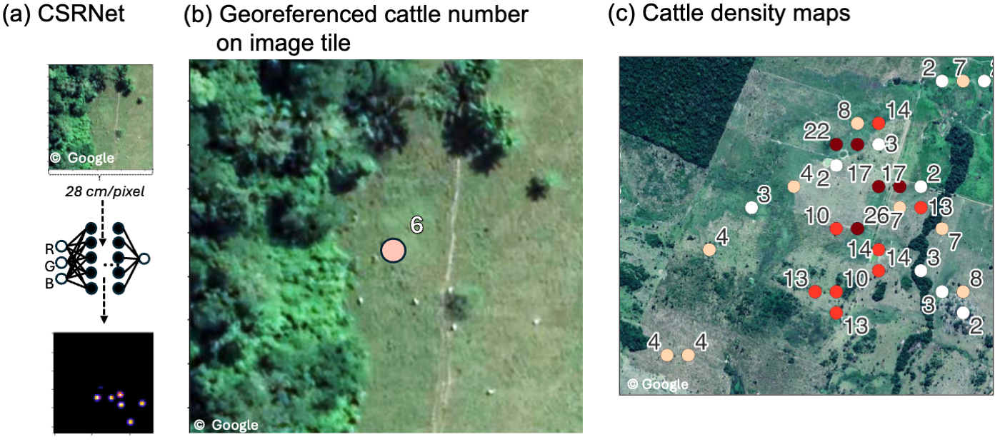

# Deep learning-based cattle counts on satellite imagery offer evidence regarding land use and policy impact in the Brazilian Amazon

Python code to the CSRNet implementation used to detect and count cattle in the Amazon (Hodel et al.,in review)

This architecture and this code is adapted from 
+ [CSRNet: Dilated convolutional neural networks for understanding the highly congested scenes,
  Li, Yuhong and Zhang, Xiaofan and Chen, Deming,Proceedings of the IEEE Conference on Computer Vision and Pattern Recognition, 2018](https://arxiv.org/abs/1802.10062)
+ [leeyeehoo/CSRNet-pytorch](https://github.com/leeyeehoo/CSRNet-pytorch.git)

## Create a conda environment with GPU support (recommended)

`conda env create -f torch_environment.yml`

`conda activate pytorch-gpu`

## Create a conda environment with CPU support only 

`conda env create -f torch_environment_cpu.yml`  

`conda activate pytorch-cpu`

## Downloads

Download [pre-trained weights](https://zenodo.org/records/13385687) for inference.

## Estimate cattle distribution on VHR satellite images

The satellite has to be a VHR satellite image (28cm/pixel)

`python inference.py parameters/ pathto/img.jpg pathto/img.kml`

Img.geojson file with geopoints for approximately every 400 px x 400 px 
containing the predicted cattle number and ensemble-generated standard deviation from the estimate. 

## Testing 
In the jupyter notebook [Ensemble-test-set.ipynb](https://github.com/leoniehodel/deepCattleCounts/Ensemble-test-set.ipynb) the ensemble of the trained CSRNet set is evaluated and an example 
image shown. The test set, as well as the full image dataset are available upon request.

## Dataset analysis

The code for the statistical analysis of the paper, as well as the cattle maps can be found 
under [/leoniehodel/deepCattleCounts_analysis](https://github.com/leoniehodel/deepCattleCounts_analysis/)