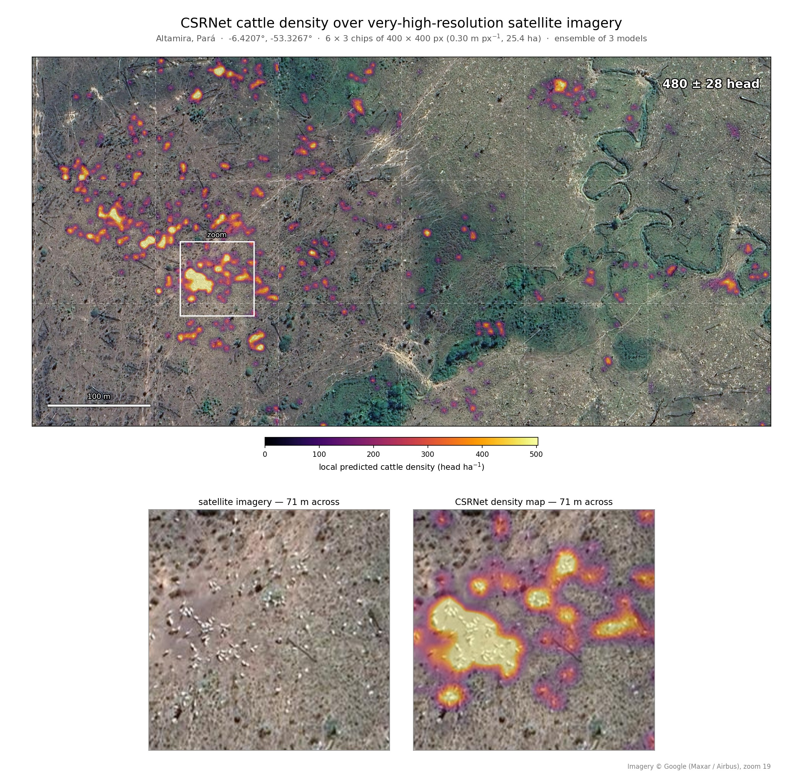

# deepCattleCount

Deep learning–based cattle counts on satellite imagery, offering evidence on land use and policy impact in the Brazilian Amazon.

This repository contains the Python code for the CSRNet implementation of [Hodel et al., 2026](https://www.nature.com/articles/s44458-026-00082-2).

This architecture and this code is adapted from 
+ [CSRNet: Dilated convolutional neural networks for understanding the highly congested scenes,
  Li, Yuhong and Zhang, Xiaofan and Chen, Deming,Proceedings of the IEEE Conference on Computer Vision and Pattern Recognition, 2018](https://arxiv.org/abs/1802.10062)
+ [leeyeehoo/CSRNet-pytorch](https://github.com/leeyeehoo/CSRNet-pytorch.git)

## Create a conda environment

`conda env create -f environment.yml`

`conda activate deepcattlecount`

## Downloads

Download [ensemble pre-trained weights](https://zenodo.org/records/13385687) for inference on new images.

The satellite imagery used for training and testing is subject to third-party licenses and can therefore not be shared.

## Estimate cattle distribution on VHR satellite images

This model is designed to perform inference on very high-resolution satellite images with a spatial resolution of ~30 cm/pixel. 
It utilizes an image file containing RGB data and a KML file that provides the geospatial context for the image.

`python inference.py parameters/ pathto/img.jpg pathto/img.kml`

The default output of the model is an Img.geojson file, which includes geospatial points corresponding to  every 400 x 400 pixel segment of the input image. 
This geospatial point contains the predicted number of cattle and the ensemble-generated standard deviation of the cattle number.

## Training and testing on new imagery

The model parameters are only trained on imagery from the Brazilian Amazon. To train a novel model instance,
new training data should be listed in the 

`python train.py --train_json train.json --test_json test.json 0 parmeters/parameter_CSR_v1`

## Cattle detection in the Amazon 

The code for the regression analysis and the the cattle counts used in Hodel, 2026 are available under 

