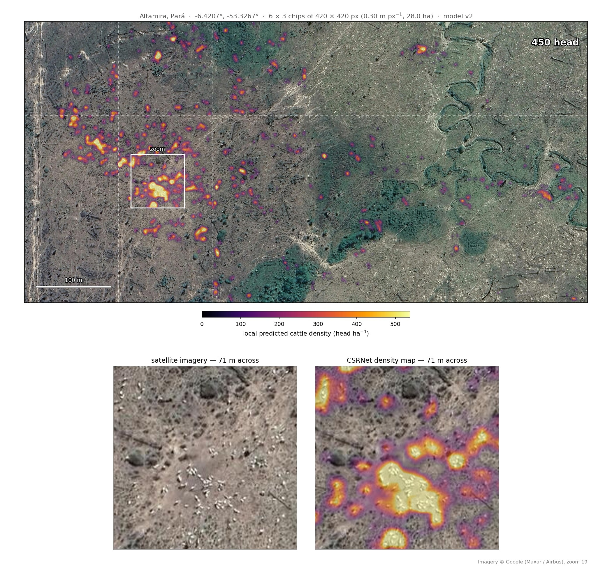
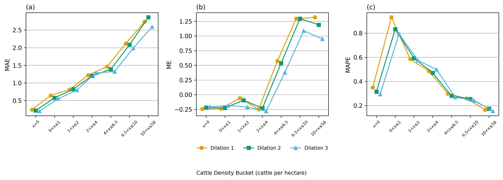

# deepCattleCount

[](https://doi.org/10.1038/s44458-026-00082-2)
[](https://www.nature.com/articles/s44458-026-00082-2)
[](https://www.nature.com/articles/s44458-026-00082-2)


Deep learning–based cattle counts on satellite imagery, offering evidence on land use and policy impact in the Brazilian Amazon.
This repository contains the Python code for the CSRNet implementation of [Hodel et al., 2026](https://www.nature.com/articles/s44458-026-00082-2) and 
Hodel, Gibbs et al. in review.



The architecture and code are adapted from 
+ [CSRNet: Dilated convolutional neural networks for understanding the highly congested scenes,
  Li, Yuhong and Zhang, Xiaofan and Chen, Deming, Proceedings of the IEEE Conference on Computer Vision and Pattern Recognition, 2018](https://arxiv.org/abs/1802.10062)
+ [leeyeehoo/CSRNet-pytorch](https://github.com/leeyeehoo/CSRNet-pytorch.git)

## Create a conda environment

The code needs Python 3.10 or newer and PyTorch 2.6 or newer; it is tested with Python 3.12 and PyTorch 2.14.
On Apple Silicon Macs, use a native (arm64) conda installation, as PyTorch no longer publishes new versions for Intel Macs.

`conda env create -f environment.yml`

`conda activate deepcattlecount`

## Downloads

Download [pre-trained weights V2](https://zenodo.org/records/22673586) for inference on new images ([version 1](https://zenodo.org/records/13385687), the ensemble used in Hodel et al., 2026, remains available). Compared to version 1, the version 2 weights are trained on more images, aren't ensemble-based 
and have a lower mean absolute error (Hodel, Gibbs et al.).

The commands below expect the weights in a folder called `parameters/` in the repository. To create it and download the v2 weights:

```
mkdir parameters
curl -L -o parameters/params_2025_dilation3_model_best.pth.tar "https://zenodo.org/records/22673586/files/params_2025_dilation3_model_best.pth.tar?download=1"
```

The satellite imagery used for training and testing is subject to third-party licenses and can therefore not be shared.

## Estimate cattle distribution on VHR satellite images

This model is designed to perform inference on very high-resolution satellite images with a spatial resolution of ~30 cm/pixel.
The image has to be 8-bit RGB; for images with more bands, bands 1–3 are read as red, green and blue.
It takes a folder with the model parameters and an image that is georeferenced in one of two ways:

+ a GeoTIFF (or JPEG2000), which carries its location and coordinate reference system, in any projection:

  `python inference.py parameters/ pathto/img.tif`

+ a JPEG or PNG with a KML file that provides the geospatial context for the image:

  `python inference.py parameters/ pathto/img.jpg pathto/img.kml`

For georeferenced images the pixel size is printed, with a warning if it is far from the ~30 cm the model is trained on.
Inference runs on an NVIDIA GPU or the GPU of an Apple Silicon Mac if available, and otherwise on the CPU.

The default output (`--output counts`) is an img.geojson file, which includes geospatial points corresponding to every 420 x 420 pixel segment of the input image.
Each point contains the predicted number of cattle and, for the ensemble (v1) weights, the standard deviation across the ensemble members.
The points are in longitude and latitude (EPSG:4326), at the centre of each segment.
Pixels at the right and bottom edge that do not fill a whole 420 x 420 segment are left out, and the script prints how much of the image this is.

The model predicts a cattle density surface, which can also be written directly:

`python inference.py parameters/ pathto/img.jpg --output density-map`

This writes img_density.tif, the density in head per cell, and img_density.png, the density drawn over the image.
For a georeferenced image, img_density.tif is a GeoTIFF in the coordinate reference system of the image and opens in place in e.g. QGIS;
the density map also works for images without a georeference. Use `--output both` to write the counts and the density map.

The dilation rate sets how far apart the weights of the 3 x 3 convolution kernels in the back end of the network are spread: with a dilation rate
of 2 a kernel covers 5 x 5 pixels, and with 3 it covers 7 x 7 pixels. This lets the network take in more of the surrounding image without adding
parameters. 
The dilation rate of the model has to match the weights (2 for v1, 3 for v2). It is set with --dilation and defaults to 3, so run 
the v1 ensemble with --dilation 2.

## Model performance



Errors on the held-out test set by cattle density for models trained with dilation rates of 1, 2 and 3:
(a) mean absolute error (MAE), (b) mean error (ME) and (c) mean absolute percentage error (MAPE).
A dilation rate of 3 performs best or on par across density classes, which is why it is the default. The dilation 3 model is the v2 model available for download.


## Projects: Brazilian Amazon property-level cattle densities and encroachment 

The code for the analysis and the cattle counts used in Hodel, 2026 are available under 
[leoniehodel/amazon_cattle_densities](https://github.com/leoniehodel/amazon_cattle_densities)

The code for the regression discontinuity at Protected Area borders used in Hodel, Gibbs et al., forthcoming is available under 
[leoniehodel/rdd_ProtectedAreas](https://github.com/leoniehodel/rdd_ProtectedAreas)


## Training and testing on new imagery

The model is only trained to detect cattle in the Brazilian Amazon. To train a novel model instance,
new training data can be labeled. Cut your images into 420 x 420 pixel patches and draw bounding boxes
(e.g., with [labelImg](https://github.com/HumanSignal/labelImg)). The bounding boxes are then converted into
density maps by placing a Gaussian kernel at the centre of each animal. Each density map is stored as an `.h5` file
(dataset `density`) next to its image, with the same name (`img_train.jpg` → `img_train.h5`).

Put the training and test images with their density maps in two folders. Images without a matching `.h5` file are skipped.
Training needs a CUDA GPU.

`python train.py --train_folder train_imgs/ --test_folder test_imgs/ 0 parameters/new_region_`

The first positional argument is the GPU id and the second is a prefix for the checkpoints, which are saved as
`<prefix>checkpoint.pth.tar` and `<prefix>model_best.pth.tar`. To continue training from existing weights, add
`--pre path/to/checkpoint.pth.tar`.
